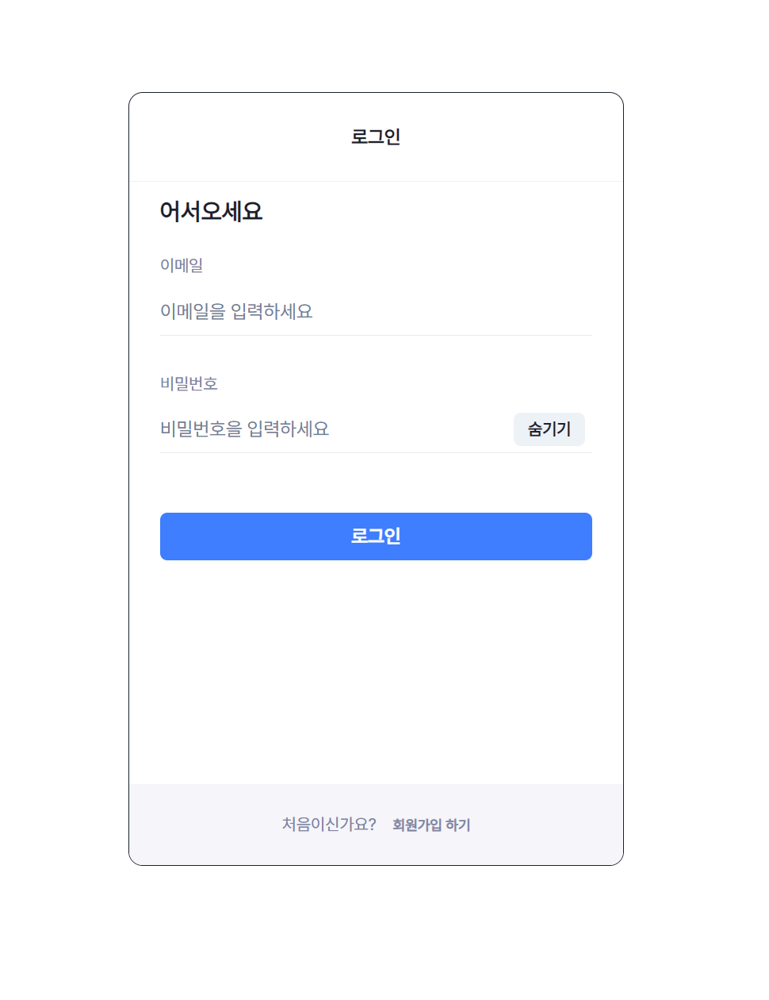
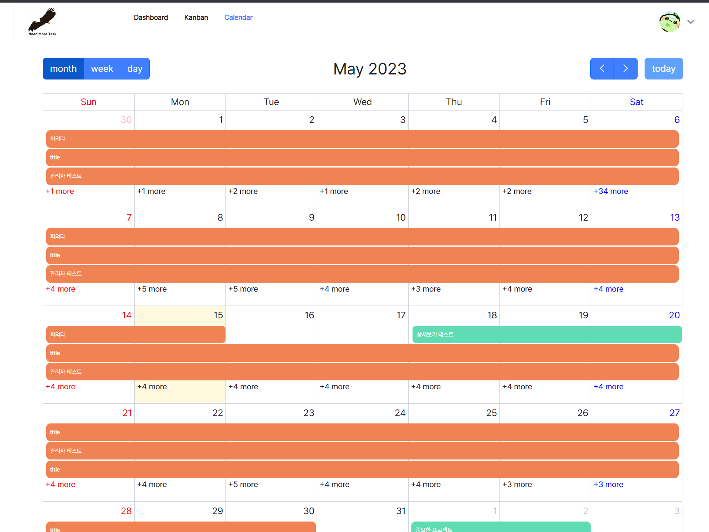
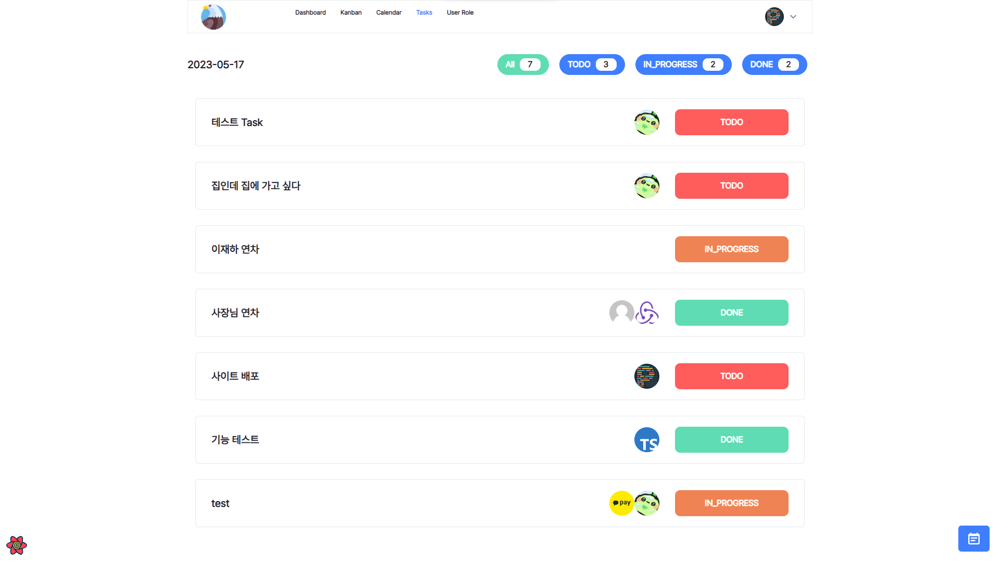
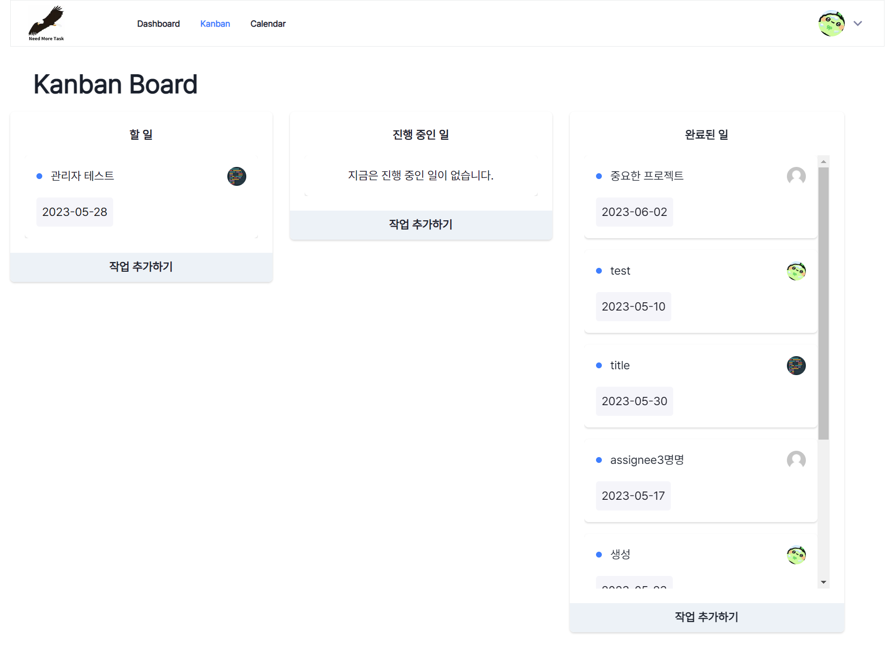
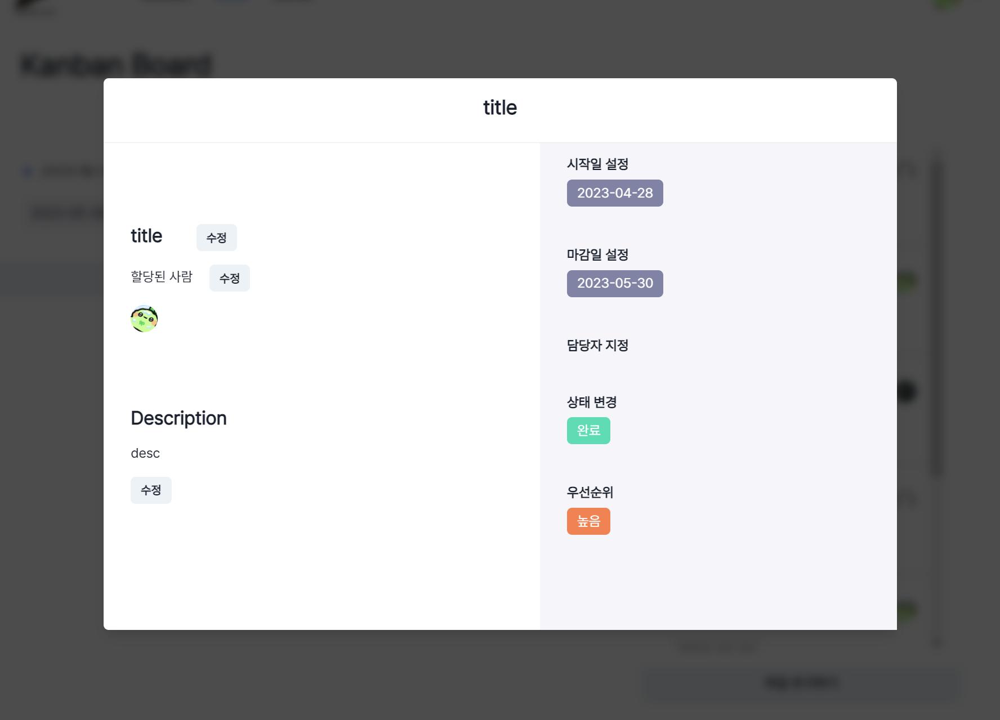
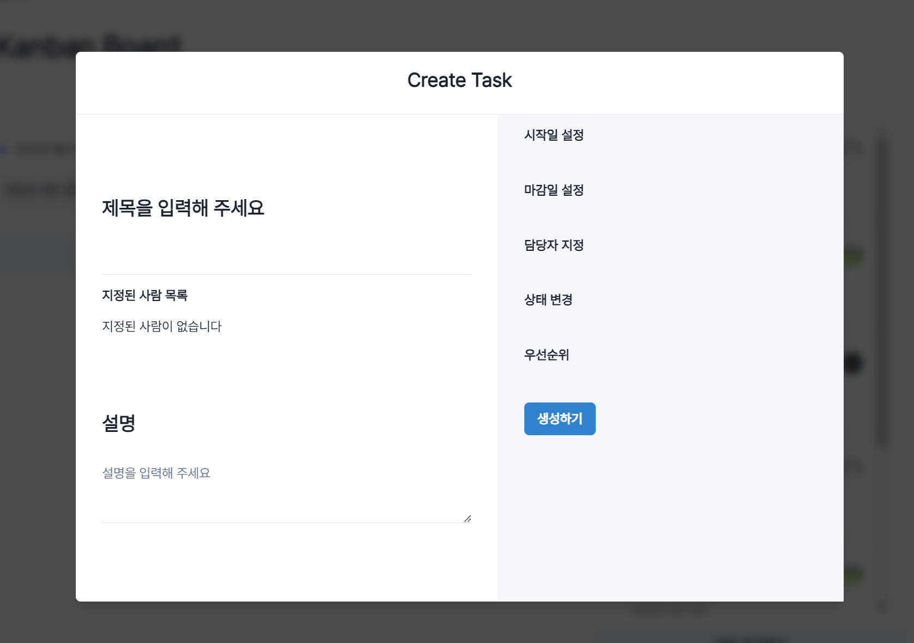
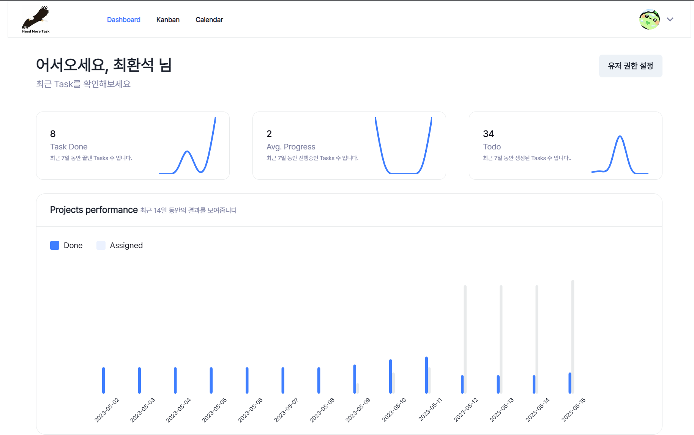
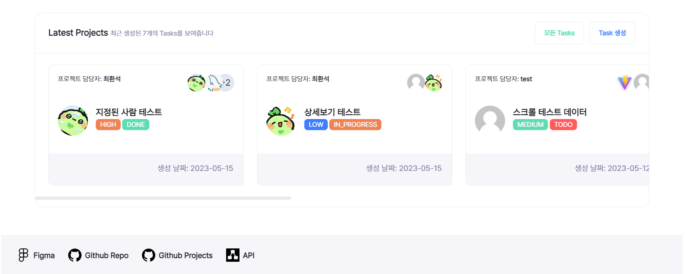
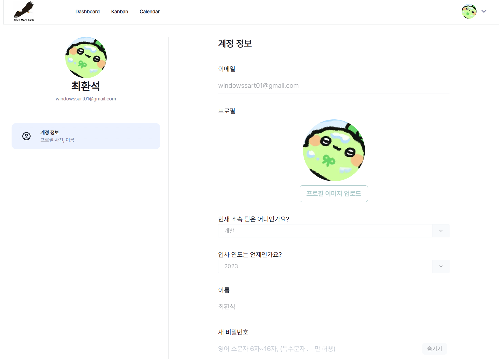
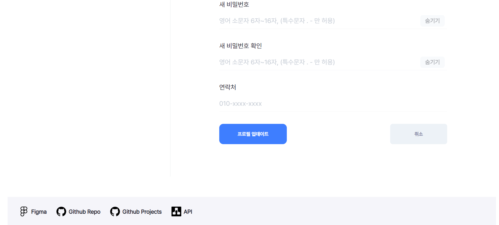

#  프로젝트 소개

## 1. 프로젝트 개요

이 프로젝트는 기업에서 사용을 하는 할일 관리 어플리케이션을 컨셉으로 잡았습니다. 그렇기 때문에 모든 기능이 할일의 관리에 맞춰서 구현이 되어있습니다.


### 1.1 프로젝트 멤버

**프론트엔드**
- [최환석](https://github.com/BeeMOre32) : 칸반 보드, 할일 모달창, 할일 생성모달
- [장현준](https://github.com/hyeon17) : 캘린더 페이지 및 모든 일 보기 페이지
- [이재하](https://github.com/jaehafe) : 회원 가입 및 로그인 페이지, 마이페이지, 대시보드

## 2. 프로젝트 스택

 - 메인 라이브러리 및 프레임워크: Next.js
 - 상태 관리: Zustand
 - 서버 통신: React-query
 - UI 라이브러리: Chakra UI
 - CSS: emotion
 - 기타 라이브러리: react-icons, react-full-calendar

## 3. 프로젝트 구조

    ```
    .
    ├── components
    │   ├── common
    │   │   ├── commonComponents
    │   ├── Page Components
    │   │   ├── Component
    ├── apis
    │   ├── api
    ├── pages
    │   ├── _app.tsx
    │   ├── _document.tsx
    │   ├── index.tsx
    │   ├── Other Pages
    ├── hooks
    │   ├── hook
    ├── utils
    │   ├── util
    ├── styles
    │   ├── global.ts
    │   ├── theme.ts
    │   ├── Style-Components
    ├── constants
    │   ├── constant
    ├── stores
    │   ├── store
    ├── types
    │   ├── type
    ```

## 4. 프로젝트 기능

- 회원가입 및 로그인
- 프로젝트 생성 및 삭제
- 프로젝트에 멤버 초대 및 삭제
- 프로젝트 전체보기
- 프로젝트 칸반보드
- 프로젝트 캘린더
- 프로젝트 대시보드
- 프로필 수정

## 5. 프로젝트 결과

### 5.1 사이트의 전체적인 모습

- 로그인 페이지 및 회원가입 페이지

 
 

- 프로젝트 캘린더 페이지

 


- 프로젝트 칸반보드 페이지

 




- 프로젝트 대시보드 페이지




- 프로필 및 프로필 수정 페이지



